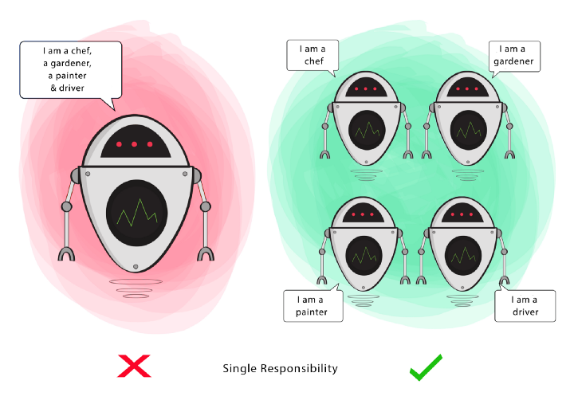

## S.O.L.I.D

## Este artigo trata-se de um descritivo sobre os princípios do S.O.L.I.D

- Os princípios do SOLID, são um conjunto de boas práticas, que tem, como objetivo, tornar mais fácil a legibilidade, testabilidade, manutenção, extensão, organização e reaproveitamento do código.

  - Cada um dos princípios representa uma técnica de design de código criada para evitar problemas já conhecidos.
  - *Apesar destes princípios serem específicos para Programação Orientada a Objetos, ainda se pode aplicar alguns deles a códigos que seguem outros paradigmas.

- Escrever códigos simples, legíveis e limpos requer prática e demanda mais tempo no início, mas não seguir as boas práticas e princípios pode ocasionar problemas no longo prazo, que também vão demandar tempo e pode impossibilitar refatorar algum trecho sem fazer outra coisa parar de funcionar. Por isso devemos sempre buscar aprimorar a qualidade do nosso código, para evitar problemas no futuro.

- No contexto de programação orientada a objetos, o acrônimo SOLID, refere-se a cinco princípios que visam facilitar o desenvolvimento, compreensão e manutenção de códigos. A adoção destas práticas ao programar, leva a diminuição de bugs no software, evita futuras refatorações e contribui para um desenvolvimento ágil e adaptativo. Isto gera impactos fundamentais na nossa produtividade e eficiência como desenvolvedores.

- Cada letra de SOLID representa a inicial de um princípio, conforme descrito abaixo:

  - S - Single Responsibility (Responsabilidade Única)
    -  Uma entidade (classe, método, função, etc) deve ter apenas uma única responsabilidade.

  - O - Open-Closed (Aberto-Fechado)
    - Entidades de software devem ser abertas para extensão, mas fechadas para modificação.

  - L - Liskov Substitution (Substituição de Liskov)
    - Objetos em um programa devem ser substituíveis por instâncias de seus subtipos, sem alterar a funcionalidade do programa.

  - I - Interface Segregation (Segregação de Interface)
    - Ter muitas interfaces específicas é melhor do que ter uma para todos propósitos.

  - D - Dependency Inversion (Inversão de dependência)
    - Entidades devem depender de abstrações, não de objetos concretos. Então as entidades de alto nível não devem depender das de baixo nível, ambas devem depender de abstrações.

- ⚠️ Aviso: É importante lembrar que ao falar de SOLID, estamos tratando de princípios. Desta forma, devemos utilizar estes conceitos para nortear a escrita do nosso código e não entender que estas regras são obrigatórias em todos os projetos.

## Aprofundando nos princípios de S.O.L.I.D

- Single Responsibility Principle

  - Este princípio nos instrui no sentido de que uma classe deve ter apenas uma razão para mudar, ter apenas uma responsabilidade dentro do sofware, ou seja, a classe deve ter uma única tarefa ou ação para executar. Além de classes, também podemos levar esta orientação para métodos, funções, tudo que é responsável por executar uma ação.

  

  

  - 📝 A violação do Single Responsibility Principle pode gerar alguns problemas, sendo eles:

    - Falta de coesão — uma classe não deve assumir responsabilidades que não são suas;

    - Alto acoplamento — Mais responsabilidades geram um maior nível de dependências, deixando o sistema engessado e frágil para alterações;

    - Dificuldades na implementação de testes automatizados — É difícil de “mockar” esse tipo de classe;

    - Dificuldades para reaproveitar o código;
