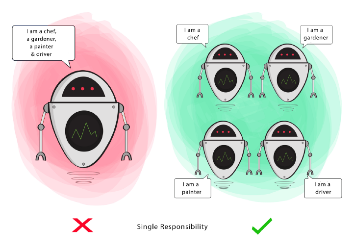
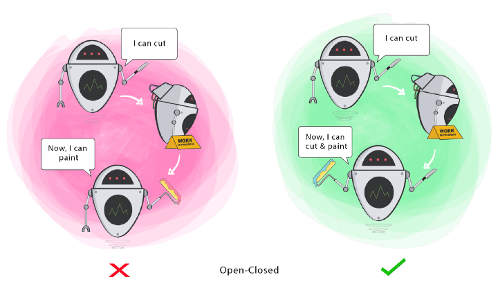
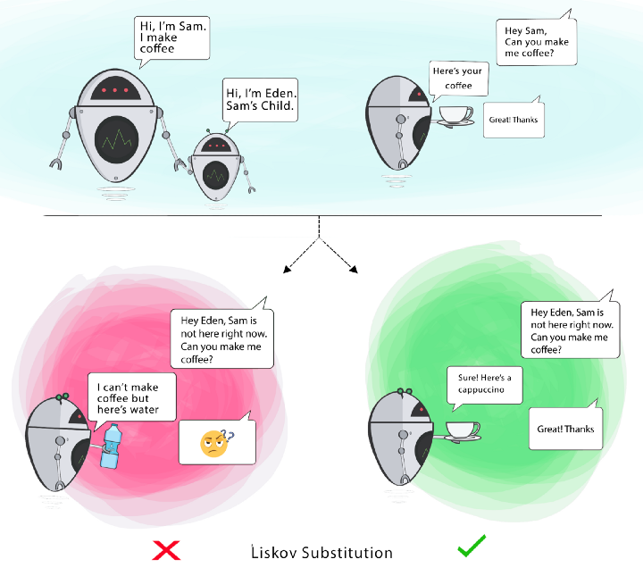
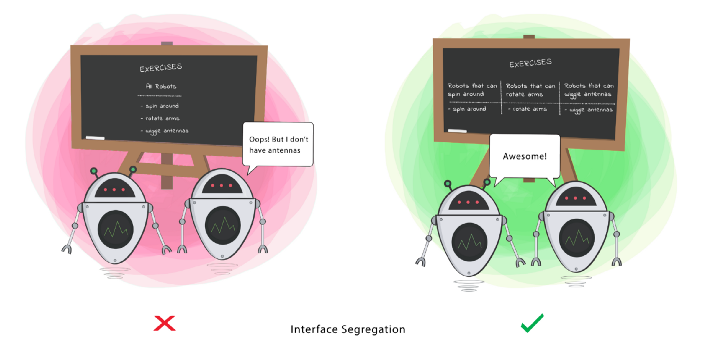

## S.O.L.I.D

## Este artigo trata-se de um descritivo sobre os princípios do S.O.L.I.D

- Os princípios do SOLID, são um conjunto de boas práticas, que tem, como objetivo, tornar mais fácil a legibilidade, testabilidade, manutenção, extensão, organização e reaproveitamento do código.

  - Cada um dos princípios representa uma técnica de design de código criada para evitar problemas já conhecidos.
  - *Apesar destes princípios serem específicos para Programação Orientada a Objetos, ainda se pode aplicar alguns deles a códigos que seguem outros paradigmas.

- Escrever códigos simples, legíveis e limpos requer prática e demanda mais tempo no início, mas não seguir as boas práticas e princípios pode ocasionar problemas no longo prazo, que também vão demandar tempo e pode impossibilitar refatorar algum trecho sem fazer outra coisa parar de funcionar. Por isso devemos sempre buscar aprimorar a qualidade do nosso código, para evitar problemas no futuro.

- No contexto de programação orientada a objetos, o acrônimo SOLID, refere-se a cinco princípios que visam facilitar o desenvolvimento, compreensão e manutenção de códigos. A adoção destas práticas ao programar, leva a diminuição de bugs no software, evita futuras refatorações e contribui para um desenvolvimento ágil e adaptativo. Isto gera impactos fundamentais na nossa produtividade e eficiência como desenvolvedores.

- Cada letra de SOLID representa a inicial de um princípio, conforme descrito abaixo:

  - S - Single Responsibility (Responsabilidade Única)
    -  Uma entidade (classe, método, função, etc) deve ter apenas uma única responsabilidade.

  - O - Open-Closed (Aberto-Fechado)
    - Entidades de software devem ser abertas para extensão, mas fechadas para modificação.

  - L - Liskov Substitution (Substituição de Liskov)
    - Objetos em um programa devem ser substituíveis por instâncias de seus subtipos, sem alterar a funcionalidade do programa.

  - I - Interface Segregation (Segregação de Interface)
    - Ter muitas interfaces específicas é melhor do que ter uma para todos propósitos.

  - D - Dependency Inversion (Inversão de dependência)
    - Entidades devem depender de abstrações, não de objetos concretos. Então as entidades de alto nível não devem depender das de baixo nível, ambas devem depender de abstrações.

- ⚠️ Aviso: É importante lembrar que ao falar de SOLID, estamos tratando de princípios. Desta forma, devemos utilizar estes conceitos para nortear a escrita do nosso código e não entender que estas regras são obrigatórias em todos os projetos.

-------

## Aprofundando nos princípios de S.O.L.I.D

### Single Responsibility Principle

  - Este princípio nos instrui no sentido de que uma classe deve ter apenas uma razão para mudar, ter apenas uma responsabilidade dentro do sofware, ou seja, a classe deve ter uma única tarefa ou ação para executar. Além de classes, também podemos levar esta orientação para métodos, funções, tudo que é responsável por executar uma ação.

  

- 📝 A violação do Single Responsibility Principle pode gerar alguns problemas, sendo eles:

    - Falta de coesão — uma classe não deve assumir responsabilidades que não são suas;

    - Alto acoplamento — Mais responsabilidades geram um maior nível de dependências, deixando o sistema engessado e frágil para alterações;

    - Dificuldades na implementação de testes automatizados — É difícil de “mockar” esse tipo de classe;

    - Dificuldades para reaproveitar o código;

-------

### Open-Closed Principle

  - Objetos ou entidades devem estar abertos para extensão, mas fechados para modificação, ou seja, quando novos comportamentos e recursos precisam ser adicionados no software, devemos estender e não alterar o código fonte original.
  

  - Objetivo: Este princípio visa estender o comportamento de uma classe sem alterar o comportamento existente dessa classe. Isso para evitar causar bugs onde quer que a classe esteja sendo usada.

  
  - *Open-Closed Principle também é base para o padrão de projeto Strategy

--------

### Liskov Substitution Principle

  - O Princípio de Substituição de Liskov diz que objetos podem ser substituídos por seus subtipos sem que isso afete a execução correta do programa.

  - se S é um subtipo de T, então os objetos do tipo T, em um programa, podem ser substituídos pelos objetos de tipo S sem que seja necessário alterar as propriedades deste programa

  - O LSP tem como objetivo manter o funcionamento do código íntegro no processo de acoplamento de funcionalidades na aplicação.

  

  
  - Esse princípio é quebrado em situações nas quais uma subclasse deixa de herdar um comportamento da classe pai, seja sobrescrevendo um método e lançando uma exceção ou não tirando proveito de todas as funcionalidades dela. Chamamos esse cenário de Refused Bequest.

  - Seguir o Princípio de Substituição de Liskov nos permite usar o polimorfismo com mais confiança. Podemos chamar nossas classes derivadas referindo-se à sua classe base sem preocupações com resultados inesperados.

--------

### Interface Segregation Principle

  - O Princípio de Segregação de Interface diz que interfaces específicas são melhores do que uma única interface de propósito geral.

  - Uma classe não deve ser forçada a implementar interfaces e métodos que não irão utilizar.

  - O Princípio de Segregação de Interface é violado quando uma classe é obrigada a implementar métodos que não utiliza. Por esse motivo, o ISP diz que as interfaces devem ser específicas (ou pequenas) para que as classes possam implementar somente os comportamentos necessários. Caso contrário, erros serão lançados.

  

  - Em resumo o Princípio de Segregação de Interface propõe que, ao definirmos uma interface, ela tenha poucos métodos e que sejam específicos dos escopos que estamos trabalhando.

  - Ao separarmos em pequenas interfaces, conseguimos reaproveitar parte do código e utilizar só o que é realmente necessário em cada caso. Isso torna nossas classes mais coesas, pois temos comportamentos e responsabilidades bem definidas.

--------

#### Fontes para a criação do artigo:

  - https://medium.com/desenvolvendo-com-paixao/o-que-%C3%A9-solid-o-guia-completo-para-voc%C3%AA-entender-os-5-princ%C3%ADpios-da-poo-2b937b3fc530

  - https://www.campuscode.com.br/conteudos/s-o-l-i-d-principio-de-substituicao-de-liskov#:~:text=O%20Princ%C3%ADpio%20de%20Substitui%C3%A7%C3%A3o%20de%20Liskov%20diz%20que%20objetos%20podem,a%20execu%C3%A7%C3%A3o%20correta%20do%20programa.

  - https://medium.com/backticks-tildes/the-s-o-l-i-d-principles-in-pictures-b34ce2f1e898

  - https://campuscode.com.br/conteudos/s-o-l-i-d-principio-de-segregacao-de-interface

  - https://campuscode.com.br/conteudos/s-o-l-i-d-principio-de-inversao-de-dependencia
